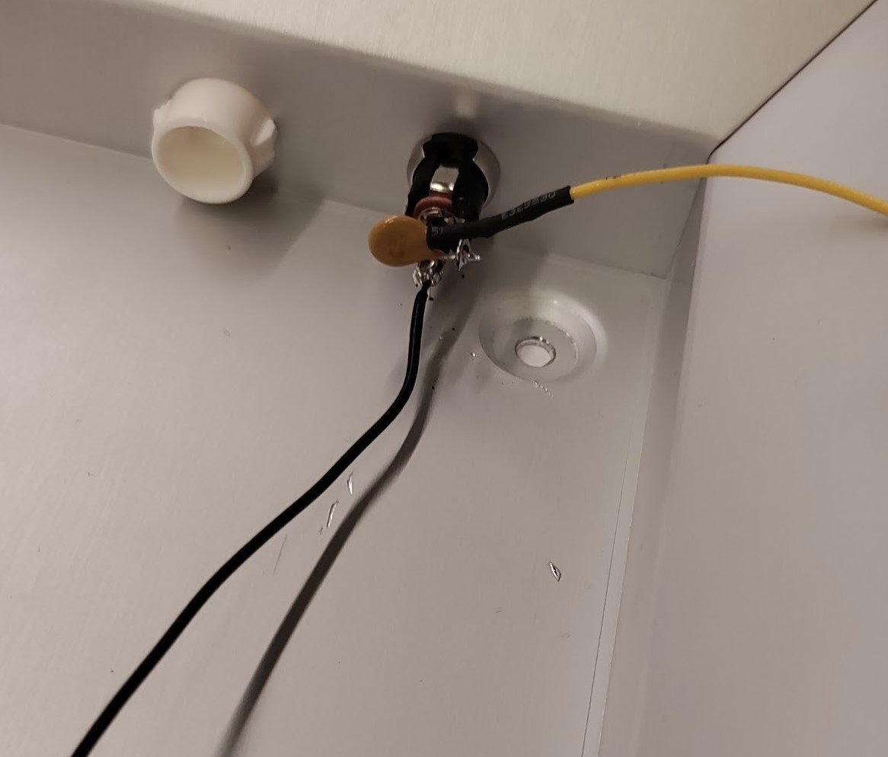
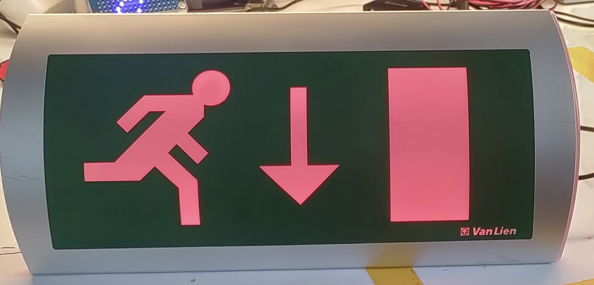

# RGB-LED-Fire-Exit-Light
Yesterday I found an unused fire exit sign. I had the idea to tune it with some RGB lights.

All the supplies I used:
|Parts list|
|--|
|Fire light|
|12V 2A power supply|
|Barrel jack socket|
|Buck converter|
|12V ledstrip WS2811S 1 meter (39 3/8 Inch)|
|Wemos D1 Mini ESP8266|
|0.5A 30V Polyfuse|
|100n capacitator|
|SN74AHCT125N quadruple 3-state buffers|
|IRLML2502 logic-level power MOSFET 20V 3.6A|

First I removed all of the old electronics.

Set the buck converter module output to 5V.

Connect the new electronics according to the schematic.

Drill a hole in the shell of the fire exit and mount the barrel jack connector. Solder the polyfuse to the center pin of the barrel jack connector.

Solder every part on a PCB according to the schematic.

Install the [Wled firmware](https://kno.wled.ge/) to the ESP8266.

Configure the Wled for the ledstrip the data output is D4. My ledstrip is 20 leds in a configuration of 5x4. My color setup is BRG.

Maximum PSU current 500mA.

Relay GPIO: 15, invert on.

This should be the result:

